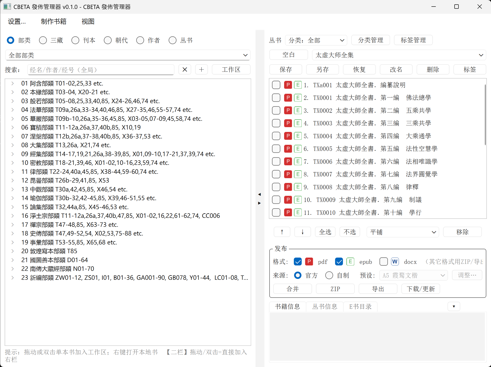

# CBETA 發佈管理器（publish 侧）

把 CBETA 官方电子书/自制 XML 电子书**按丛书整理、合并、打包、校验**的桌面工具
（PySide6）。路径「浏览 → 勾选 → 工作区 → 右栏丛书 → 发布」。

- 单一来源的应用名/短名/版本见 `cbeta_publish/__init__.py`
  （`APP_NAME` / `APP_ID="cbeta-publish"` / `__version__`）。
- 跨仓调用契约见 `docs/链路B-设计契约.md`；UI 设计见 `docs/UI设计.md`；
  总方案见 `docs/设计总案.md`；待办见 `TODO.md`。

## 界面预览



## 示例输出（`demo/`）

`demo/` 放了几份**真实产物**，方便直接查看效果：

- `demo/cbeta_xml_ebooks/`：自制书输出（`{id 书名}.docx` / `.pdf`，如 `CC0003…`、`T1711…`）。
- `demo/collections_books/`：丛书合并产物（`.epub`，如《大乘起信论》解题、圓測法師著作集 等）。

输入侧的演示丛书在 `collections/`（作者/主题/经/自定义示例）。

## 环境要求

- Windows 10/11
- Python 3.11–3.13（3.14 视 PyInstaller 支持而定）
- 制书功能另需：xml2pdf 仓库 [cbeta-xml2pdf](https://github.com/Zen-Bear/cbeta-xml2pdf)（`pycbeta`）与其依赖。

## 安装

```bat
python -m venv .venv
.venv\Scripts\activate
pip install -r requirements.txt
```

制书（链路 B）另需 xml2pdf 仓库 [cbeta-xml2pdf](https://github.com/Zen-Bear/cbeta-xml2pdf)（`pycbeta`）与其依赖：

```bat
REM 让 publish 能 import pycbeta：安装/克隆 cbeta-xml2pdf 或把仓库放到 config 的 xml2pdf.path
```

## 运行

```bat
REM 方式一
python -m cbeta_publish.app

REM 方式二
python cbeta_publish\app.py
```

窗口标题与 `QApplication` 元数据取自 `cbeta_publish/__init__.py`。

## 配置

配置写 `config/app.json`（首次运行自动生成；设置页「保存」落盘，
「确定」仅本次生效；`mulu/backup/` 存上次/原始配置副本）。

关键项：

- 目录：`mulu_dir`（目录数据）、`collections_dir`（丛书）、`official_ebooks_dir`
  （官方缓存）、`xml_to_ebooks_dir`（自制书）、`verify_dir`（校验）、`output_dir`
  （丛书输出）。绝对路径或相对工程根。
- 来源/格式：`default_source`（official/xml）、`default_formats.{merge,official,xml}`。
- 制书：`xml2pdf.path`（cbeta-xml2pdf 仓库）、`xml2pdf.cbeta_ebook`（CBETA XML 目录，
  `--cbeta-ebook`）、`xml2pdf.preset`、`xml2pdf.verify_build`。
- 分册：`merge.mode`（none/volume/catalog/manual/ask）、`merge.depth`、
  `merge.name_template`、`merge.ask_last`。
- 封面/版式：`cover.*`（含 `bulei`/`edit_note`/`styles`/`positions`）。
- 本地库：`official_library.{root,overrides}`（本地优先、缺失回退下载）。

`mulu/` 为选配的目录元数据（`bulei.txt`/`category.json`/`vol.json`/
`dynasty-works.json`/`SutraList.json`/`sutra_mapping.txt` 等），可在
「设置 → 更新源」下载/更新。

## 目录结构（要点）

```
cbeta_publish/          源码（app.py 入口；paths.py；gui/ books/ catalog/ collection/ creators/）
config/app.json         配置（可写）
mulu/                   目录数据（可写；backup/ 存配置副本）
collections/            演示/用户丛书 JSON（可写）
assets/images/          封面图（B01/B02、1.*/2.* 回退）
assets/fonts/           封面标题字体（朝華標題B.ttf）
cbeta_ebooks/           官方电子书缓存
cbeta_xml_ebooks/       自制书输出
cbeta_verify/           校验工作目录
collections_books/      丛书合并/打包输出
demo/                   示例产物（自制 docx/pdf、合并 epub）
packaging/ build_exe.ps1  打包脚本与说明
```

## 打包为独立 exe

见 `packaging/README.md`。一键：

```powershell
powershell -ExecutionPolicy Bypass -File build_exe.ps1
```

产物 `dist\cbeta-publish\`（整目录可拷贝到任意机器运行）；默认同时生成交付包
`dist\cbeta-publish.zip`（`-NoZip` 跳过）。

## 测试

```bat
python -m unittest discover -s tests
```

## 许可证

GNU General Public License v3.0（GPL-3.0）。见 `LICENSE`。

Copyright (C) 2026 Zen Bear。
